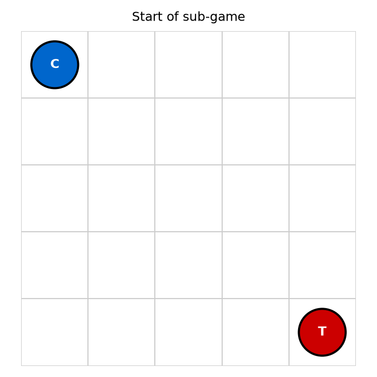
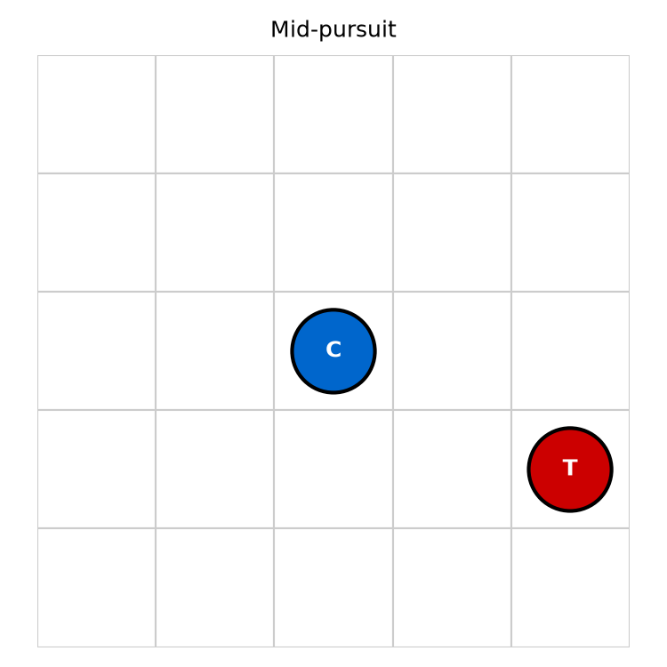
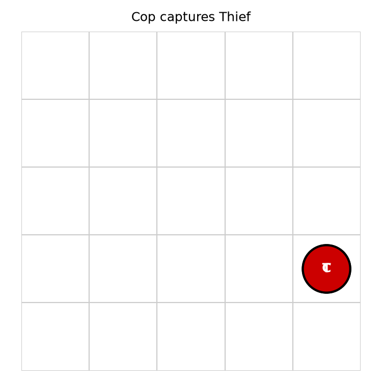

# CopThief

[](https://github.com/Mhmdabad/cop_theif__game/actions/workflows/ci.yml)

A local, fully deterministic engine for the classic **Cop vs. Thief** pursuit
game, with optional LLM-driven agents, MCP servers, tabular Q-Learning, and
Gmail report delivery.

## Table of contents

1. [Overview](#overview)
2. [Installation](#installation)
3. [Quick start](#quick-start)
4. [Usage and flags](#usage-and-flags)
5. [Examples and demos](#examples-and-demos)
6. [Configuration guide](#configuration-guide)
7. [Cost analysis](#cost-analysis)
8. [Dec-POMDP model](#dec-pomdp-model)
9. [Orchestration challenge](#orchestration-challenge)
10. [Screenshots](#screenshots)
11. [Development](#development)
12. [License and credits](#license-and-credits)
11. [License and credits](#license-and-credits)

## Overview

CopThief runs a configurable number of sub-games on a rectangular grid. The Cop
agent tries to capture the Thief; the Thief tries to evade until the move limit
is reached. Roles swap halfway through a match so each agent is scored as both
Cop and Thief.

Key features:

- Deterministic game engine with barriers and partial observability.
- Abstracted LLM provider interface (Anthropic / OpenAI).
- MCP agent-server contract for natural-language play.
- File + Gmail report sinks.
- Heuristic and optional Q-Learning strategies.
- Real-time tkinter board and analysis notebooks.

## Installation

Requires Python 3.10+ and [uv](https://docs.astral.sh/uv/).

```bash
git clone https://github.com/Mhmdabad/cop_theif__game.git
cd cop_theif__game
uv sync
```

### Environment variables

Copy `.env-example` to `.env` and add your provider keys:

```bash
cp .env-example .env
```

```text
ANTHROPIC_API_KEY=sk-ant-...
OPENAI_API_KEY=sk-...
```

### Troubleshooting

- `tkinter` is required only for the GUI and is usually bundled with Python.
- If `uv sync` fails with a build error, ensure you are using Python 3.10 or
  newer.
- Gmail delivery requires a downloaded `credentials.json` and OAuth flow; the
  core run works without it because email is opt-in.

## Quick start

Run a full local match:

```bash
uv run copthief --config config/config.json
```

The command writes `results/game_report.json` and prints a turn log.

## Usage and flags

```bash
# Heuristic mode — in-process strategies, free, no API key needed
uv run copthief --config config/config.json

# MCP mode — the assignment's showcase pipeline: spawns the two agent
# servers as separate processes and drives the natural-language dialogue
# through the configured LLM (requires ANTHROPIC_API_KEY in .env)
uv run --env-file .env copthief --mode mcp --config config/config.json
```

| Flag | Default | Description |
|------|---------|-------------|
| `--config` | `config/config.json` | Path to the JSON configuration file. |
| `--mode` | `heuristic` | `heuristic`: in-process strategies (free). `mcp`: real MCP servers + LLM dialogue. |

In MCP mode the launcher starts Agent-A (`:8101`) and Agent-B (`:8102`) as
**separate processes**, authenticates both over their MCP tools, and the
orchestrator exchanges free natural-language intents between them via the LLM.
Both modes apply the same partial observability (`vision_radius`) and write
the same JSON report.

### Official results

The committed [`results/game_report.json`](results/game_report.json) is the
output of the official **MCP-mode** run — a full 6-sub-game series on the 5×5
grid played end-to-end by the two agents through real MCP servers and LLM
natural-language dialogue (not the heuristic demo mode). Re-running either
mode overwrites the file locally.

The report follows the assignment's §9.1 schema exactly (`group_name` is the
course group ID, `cop_mcp_url`/`thief_mcp_url`, flat `totals`), with the
role-swap detail (`team_name`, per-agent URLs and totals) appended as extra
keys that automated parsers ignore.

[`results/official_run_evidence.txt`](results/official_run_evidence.txt) is
the CLI log of that run — both agent servers starting on their ports, the SSE
sessions connecting, and 123 MCP tool-call requests — attesting to live
communication with the MCP servers during the game.

Other entry points:

```bash
# Real-time GUI board
uv run python -m copthief.gui.app

# Generate UI state screenshots
uv run python scripts/capture_ui_screenshots.py

# Run the test suite
uv run pytest --cov
```

## Examples and demos

### CLI output

```text
Starting CopThief local run: 6 sub-games on a 5x5 grid

Turn log / Sub-game results:
  Sub-game 1: cop=A thief=B winner=thief_win moves=25
  ...

Totals: {'by_role': {'cop': 30, 'thief': 60}, 'by_agent': {'agent_a': 45, 'agent_b': 45}}
Report written to results/game_report.json
```

### GUI demo

```bash
uv run python -m copthief.gui.app
```

Press **Start** to watch the heuristic agents play live.

### Q-Learning notebook

Open `notebooks/qlearning_analysis.ipynb` for learning curves, sensitivity
analysis, and heatmaps.

## Configuration guide

`config/config.json` contains all tunables:

```json
{
  "version": "1.00",
  "grid_size": [5, 5],
  "max_moves": 25,
  "num_games": 6,
  "max_barriers": 5,
  "vision_radius": 2,
  "scoring": { "cop_win": 20, "thief_win": 10, "cop_loss": 5, "thief_loss": 5 },
  "llm": { "provider": "anthropic", "model": "claude-sonnet-5", "temperature": 0.7 },
  "mcp": { "agent_a_port": 8101, "agent_b_port": 8102, "host": "127.0.0.1" },
  "roles": { "swap_at_subgame": 4 },
  "reporting": {
    "email_enabled": false,
    "instructor_email": "rmisegal+uoh26b@gmail.com",
    "gmail_credentials_path": "credentials.json",
    "gmail_token_path": "token.json"
  },
  "strategy": { "type": "heuristic" }
}
```

| Section | Purpose |
|---------|---------|
| `grid_size` | Board dimensions. |
| `max_moves` | Move limit per sub-game. |
| `num_games` | Number of sub-games in a match. |
| `swap_at_subgame` | Index where Cop/Thief roles swap. |
| `vision_radius` | Chebyshev distance for partial observability. |
| `reporting` | File sink always; Gmail sink when `email_enabled` is true. |
| `strategy` | `heuristic` (default) or `qlearning`. |

## Cost analysis

When LLM-driven agents are enabled, every move triggers one LLM call per
agent. The dialogue prompt is short (~150 input tokens) and the expected
response is a single action phrase (~5 output tokens).

Approximate cost for the default 5×5, 6-sub-game match (`max_moves=25`):

| Model | Input $/M | Output $/M | Calls | Input tokens | Output tokens | Estimated cost |
|-------|-----------|------------|-------|--------------|---------------|----------------|
| Anthropic Claude Sonnet 5 | ~$3.00 | ~$15.00 | 300 | 45,000 | 1,500 | ~$0.16 |
| OpenAI GPT-4o | ~$2.50 | ~$10.00 | 300 | 45,000 | 1,500 | ~$0.13 |
| OpenAI GPT-4o-mini | ~$0.15 | ~$0.60 | 300 | 45,000 | 1,500 | ~$0.01 |

### Optimisation strategies

- Use the **heuristic** or **Q-learning** strategy for local development and
  sanity checks; it requires zero LLM calls.
- Reduce `max_moves` or `num_games` for faster, cheaper experiments.
- Lower the model tier (e.g. GPT-4o-mini) when evaluating prompt quality.
- Cache prompts and reuse them across symmetric sub-games.

## Dec-POMDP model

The game is a **decentralised partially observable Markov decision process**
(Dec-POMDP):

\[
\langle n, S, \{A_i\}, P, R, \{\Omega_i\}, O, \gamma \rangle
\]

- \(n = 2\): Cop and Thief.
- \(S\): set of joint states \((c, t, b, \tau)\) where \(c\) is the Cop cell,
  \(t\) the Thief cell, \(b\) the barrier set, and \(\tau\) the move counter.
- \(A_i\): Cop may move to any of 8 neighbours or place a barrier; Thief may
  only move.
- \(P(s' \mid s, a)\): deterministic transition validated by the engine.
- \(R(s, a)\): zero except at terminal states, where Cop capture yields the
  configured Cop win/Thief loss and timeout yields Thief win/Cop loss.
- \(\Omega_i\): each agent observes its own cell and, if the opponent is within
  Chebyshev distance `vision_radius`, the opponent cell.
- \(O(o_i \mid s, a)\): deterministic observation function implemented by the
  dialogue manager.
- \(\gamma\): discount factor for the optional Q-Learning agent.

## Orchestration challenge

The main orchestration difficulty is that the agents communicate through
natural-language intents delivered by MCP servers. The engine therefore has to:

1. Parse free-text intents into legal actions.
2. Fall back to a safe heuristic when the LLM proposes an illegal move.
3. Detect MCP/LLM failures and re-run the sub-game so the match always reports
   six valid games.
4. Enforce partial observability so agents do not see the opponent unless they
   are close enough.

This separation keeps the ground-truth engine deterministic and testable while
allowing the agents to be swapped between heuristic, Q-Learning, or LLM-driven
policies.

## Screenshots

### Start of sub-game



### Mid-pursuit



### Capture



See [`docs/ui_workflow.md`](docs/ui_workflow.md) for the full state gallery and
accessibility notes.

## Development

Install the dev toolchain:

```bash
uv sync --group dev
```

Run the quality gate locally (same command as CI):

```bash
uv run ruff check .
uv run ruff format --check .
uv run mypy
uv run pytest --cov --cov-report=term-missing
```

### Line limit

All source files are kept under 150 lines (checked in CI by
`scripts/check_line_limit.py`).

## License and credits

MIT License — see `pyproject.toml`.

- Sutton, R. S., & Barto, A. G. (2018). *Reinforcement Learning: An
  Introduction* (2nd ed.). MIT Press.
- Watkins, C. J. C. H. (1989). Learning from delayed rewards. PhD thesis,
  University of Cambridge.
