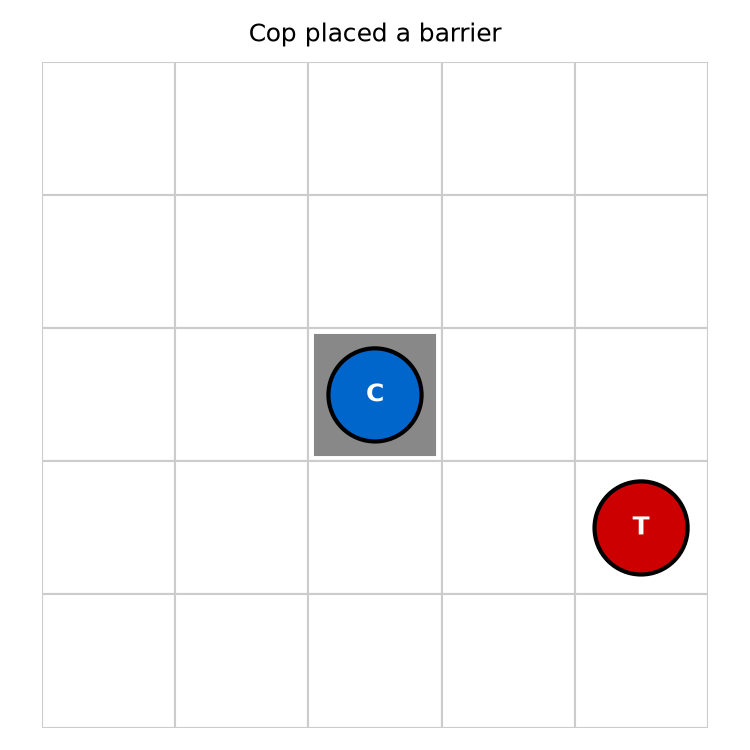
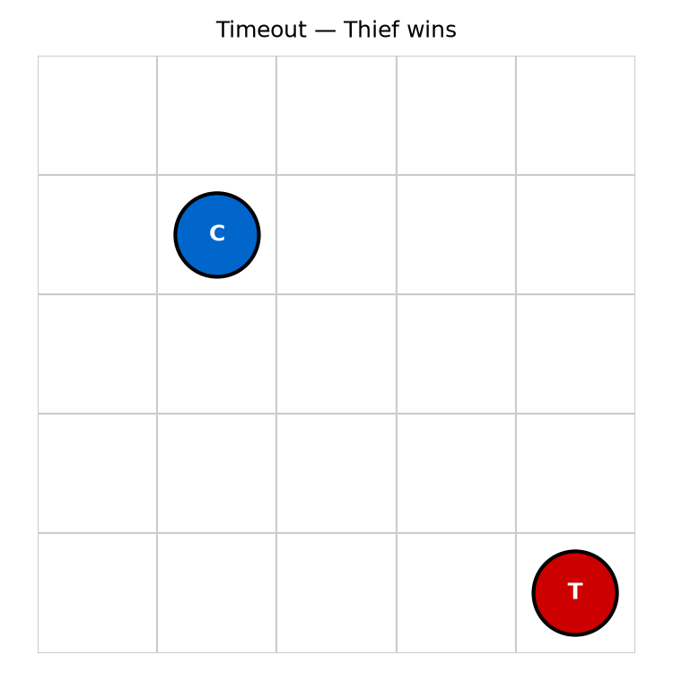

# UI Workflow & State Screenshots

The CopThief GUI (`src/copthief/gui/app.py`) renders the board live as a
sub-game progresses. Below are the five key states a user sees during play.

## Accessibility Notes

- Each piece has both a colour **and** a text label: **C** for Cop (blue) and
  **T** for Thief (red).
- Barriers are shown as grey-filled cells with no label, distinct from the
  white board background.
- The status bar at the bottom announces the current turn and outcome.
- Colour contrast is chosen so the pieces remain distinguishable in
  grey-scale.

## State Screenshots

### 1. Start of sub-game

Cop starts at the top-left corner; Thief starts at the bottom-right corner.

### 2. Mid-pursuit

Both agents have moved toward the centre of the board.

### 3. Barrier placed

The Cop has placed a barrier on its current cell to restrict the Thief's path.

### 4. Capture

The Cop has moved onto the Thief's cell and the sub-game ends.

### 5. Timeout

The move limit was reached without capture; the Thief wins the sub-game.

## User Workflow

1. Launch the GUI with `uv run python -m copthief.gui.app`.
2. Press **Start** to begin the animated sub-game.
3. Watch the status bar for turn-by-turn updates.
4. The game ends automatically on capture or timeout; press **Start** again
   for a new sub-game.
